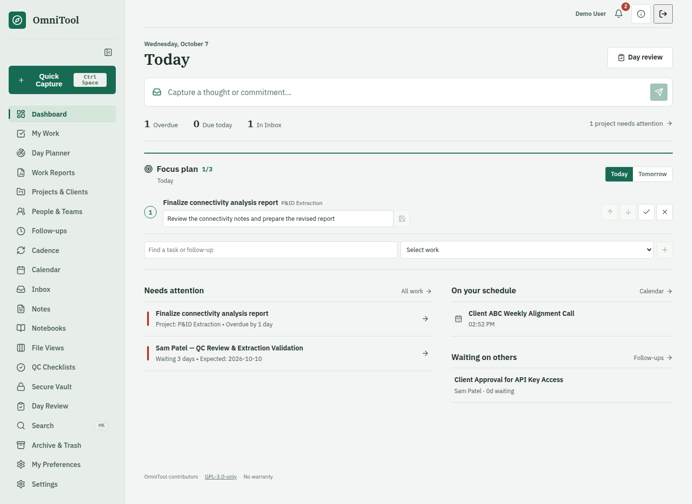

# OmniTool

OmniTool is a browser-based work command centre that brings projects, tasks, follow-ups, meetings, and notes into one place. It helps you see what needs attention, capture new requests quickly, and keep track of commitments across projects.

Built for individuals and small teams coordinating client or internal work, especially when deadlines, approvals, and trackers are scattered across spreadsheets, calendars, and conversations. You host it on your own computer or private server, keep control of your data, and can use the core workflows without AI.



*The signed-in dashboard, shown with demo data.*

OmniTool is free software under [GNU GPL version 3 only](LICENSE), provided without warranty. Dependency and font licenses remain separate; see [THIRD_PARTY_NOTICES.md](THIRD_PARTY_NOTICES.md).

## Getting Started

Requires Node.js 20.9+.

```bash
npm install
npm run dev -- --hostname 127.0.0.1
```

Open http://127.0.0.1:3000 and create the first Admin account at `/setup`. For a production build, run `npm run build` then `npm start -- --hostname 127.0.0.1`. Data is stored in `omnitool.db` by default; `DATABASE_PATH` selects another SQLite file. OmniTool authenticates all app pages and APIs with server-verified sessions. If you expose it beyond localhost, use HTTPS and a trusted reverse proxy, set `BETTER_AUTH_URL` and the Settings app origin to the public URL, and protect backups and server secrets from other users on the host.

Local authentication accepts both `http://localhost:3000` and `http://127.0.0.1:3000`. For another port, set `BETTER_AUTH_URL` to that local origin; only its same-port loopback alias is also trusted. A non-local `BETTER_AUTH_URL` does not automatically trust localhost.

Admins can invite other accounts from Settings using a one-time link. Members can edit shared work; Viewers have read-only access. Admin-only settings, credentials, Vault, export, and integrations are not available to other roles. These roles are workspace-wide, not project privacy boundaries. The Screen Lock PIN is per account and only hides that account's browser UI; signing in is the actual access control.

## Workflows

- **Recurring project work:** In a project, select **Cadence**, or open **Cadence** from the sidebar. Choose daily, working days, weekly, biweekly, monthly, quarterly, or yearly timing. Monthly rules support the same day, fifth/last working day, and nth/last weekday. Each due occurrence creates a task under that project, not a clone of the whole project; catch-up is capped at 60 occurrences per processing pass. Pause and resume rules in Cadence.
- **Focus Plan:** On Today, choose up to three existing tasks or follow-ups and write the next concrete action for each. Reorder or remove them without changing the underlying work. Completing a slot also completes its task or resolves its follow-up. Day Review opens tomorrow's plan so unfinished commitments from earlier days can be carried over explicitly rather than silently copied. The plan and its decisions are included in JSON export.
- **People and teams:** Add people under **People & Teams**, group them into teams, and designate a team lead. In Project Overview, attach teams or individuals; team members also appear there by inheritance. Assign a person on a task, or link a follow-up to a directory person. External contacts may remain free text. Archiving preserves existing references. These are coordination records, not user accounts or permissions.
- **Notebooks:** Create a notebook, then pages within it. Pages support headings, lists, links, tables, and formatting. Save explicitly; edits made in another tab are rejected rather than silently overwritten. The revision selector can restore an earlier save. Export a page or entire notebook as DOCX; Print offers the browser's PDF output. Notebooks are separate from lightweight Notes.
- **Screen Lock:** Set a four-digit PIN in Settings. Use the header lock control or choose an inactivity interval. This hides the browser interface, but does not encrypt data or restrict API access. If the PIN is forgotten, an administrator with machine access can run `npm run lock:reset -- <account email>`. Set `DATABASE_PATH` first when using a non-default database; the command removes only that account's PIN.
- **AI suggestions:** Configure an optional OpenAI-compatible provider in Settings. In Inbox, request a suggestion for a selected capture, then inspect and edit it before choosing Convert & Save. In Week Review, choose Draft with AI to generate a preview from up to 12 titles and dates per list of completed work, due tasks, waiting follow-ups, next-week tasks and meetings. Titles may contain names; notes, contact fields and locations are excluded. Use draft fills the review form only after your confirmation when replacing text; Save draft or Finish week review remains manual. No data is sent or written by AI without an explicit action.
- **Calendar overlays:** Microsoft 365 and Google Calendar can be connected separately in Settings. Both imports are read-only and their events are marked by source in Calendar; local events remain editable. For Google, enable the Calendar API in Google Cloud, create a Web application OAuth client, and register the exact callback URI shown in Settings. Google requests read-only event scope for the primary calendar and refreshes a bounded 30-day-past/180-day-future cache. Live OAuth requires your own credentials.
- **Week Review:** Select Week in Review for completed work, due/overdue tasks, waiting follow-ups, and next week's work and meetings. Save a personal draft or finish the week; the notes and completion state are stored per account.
- **Developer tools:** Settings contains OmniTool's Developer & Data section. The separate bottom-left Next.js badge appears only in `next dev`; choosing Hide in that badge's menu suppresses it for up to 24 hours. Restart the dev server to show it again. The badge is not available in `next start` production mode.

Settings can download a JSON snapshot of workspace records, including notebooks and revisions. It is not an import or full recovery format. For full recovery, stop writes or let the SQLite online backup take a consistent snapshot:

```bash
npm run backup -- /secure/new-backup-directory
npm run backup:verify -- /secure/new-backup-directory
npm run backup:restore -- /secure/new-backup-directory /secure/new-install/omnitool.db
DATABASE_PATH=/secure/new-install/omnitool.db npm start -- --hostname 127.0.0.1
```

Restore only writes to a **new** database path and will not overwrite existing data or a server secret. Backups contain the SQLite database plus `.omnitool_secret` when present; store them privately and keep the Vault password separately. A restored copy preserves accounts, sessions, notes, encrypted settings and tokens. Set `DATABASE_PATH` (and `OMNITOOL_SECRET_PATH` if using a custom server-secret location) for non-default installations before backup. Never publish these files.

## Operational Workflows

- **Work Reports:** Open the consolidated projects/tasks view for all-time history, not only today's active work. Filter by kind, status, priority, owner, project/client/person, due/delivery or created/completed date range, and archived inclusion. CSV/Excel extracts all matching records up to 10000, not just the visible page; narrow filters for larger datasets or exports exceeding 20 MB of source records. Values exceeding Excel's 32767-character cell limit require CSV or a narrower report. Timestamp-based created filters use UTC dates. Report exports contain shared work, not Vault or private notes.
- **Project completion:** Complete or reopen a project from its detail header. Completion records actual delivery if absent and pauses cadence rules. Open tasks and follow-ups remain unchanged after confirmation; reopening does not silently resume cadence. Completion is independent of archive/delete and derived health.
- **Working space:** Collapse the global navigation to icon links with tooltips. Notebook and file hierarchy panels collapse independently; notebook Focus editor hides both local rails. These layout choices persist on the device. Wide file tables scroll horizontally inside their table region.
- **Enhanced notebook editing:** Select font family/size, text/highlight colour, alignment, line spacing, checklists, code, lists/indentation, and tables with insert/delete/merge/split/header controls and column resizing. Reading mode and word/character counts complement explicit saves and revision history. Rich DOCX extraction preserves typography, checklists, code, colours, and merged-cell structure. Viewer accounts cannot edit the document.
- **Configuration:** My Preferences groups Alerts, Working Time, Reminders, and Account. Settings groups Workspace Access, Security, Integrations, Data & Recovery, and System, rather than showing every configuration form at once.

- **My Work:** Choose Assigned to me, Following, or Workspace. Linked directory assignments take precedence; legacy owner text is matched to the signed-in name. Project, client, person, priority, and waiting filters can be saved as named account-owned views. Select up to 100 tasks/follow-ups for atomic rescheduling, completion, cancellation, following, archive, or Trash; reassignment applies to tasks.
- **Notes and notebooks:** New records default to private. Owners can explicitly share them; existing records remain shared after upgrade. Search, project/task context, nested notebook routes, and JSON export enforce the same visibility. Workspace roles still do not implement private projects. Notebook revisions and task/note/project stale-tab checks protect saved work; editors preserve rejected drafts.
- **Archive and Trash:** Archive hides the selected record without deleting it; it does not silently archive linked commitments. Task, ordinary-note, project, and local-event deletion moves records and cascading children into owner-scoped Trash. Use Undo or Archive & Trash to restore. Conflicting IDs or missing parents reject the whole restore. Permanent deletion requires account-password verification and confirmation. The default 30-day review age is configurable; no automatic purge occurs. Backups retain their own copies.
- **Calendar outcomes:** Upcoming includes ongoing events; Past and Date range retain available history. Local events are editable, imported events remain provider-owned, and overlaps are marked. Create an explicitly accepted note, task, or follow-up from a meeting; its origin is retained. Calendar caches show stale state and sync failures. Provider history is limited to its configured cache window; local history is preserved until archived or deleted.
- **My Preferences:** Configure alert categories, desktop alerts, quiet hours and timezone, meeting lead time, working hours, days off, and daily work budget. Create personal reminders with a precise time. Notification read and snooze state is per account. Alerts require an open app; there is no service worker, closed-browser push, or always-on scheduler.
- **File Views:** Import read-only `.xlsx` or `.csv` tracker snapshots. Select sheets, search/filter columns, sort, hide columns, and page through rows. New trackers are private; owners may share, refresh, or archive them. Map a stable, unique row-ID column, title, optional ISO/Excel-date due date, and waiting-on column. Explicitly convert up to 100 selected rows to shared workspace tasks or follow-ups. Repeated conversion and refresh preserve links without creating duplicates or overwriting work. A mapped sheet/header-layout change requires a new tracker. Limits: 10 MB upload, 50 MB ZIP expansion, 20 sheets, 10000 data rows and 100 columns per sheet, 200000 cells total. Macros are rejected, formulas are not evaluated, external links are not fetched, and legacy `.xls`/`.xlsb` files must first be saved as XLSX or CSV. This is not a spreadsheet editor or bidirectional sync.
- **Day Planner and Unblock Radar:** Set task estimates in Task Detail; older/unestimated tasks start at 30 minutes. The planner shows timezone-aware working-day capacity, counts overlapping meetings only once, and suggests ready work that fits free windows. Add individual suggestions to Focus explicitly. Radar ranks active dependency chains by downstream impact and previews which tasks would lose their dependency blockers if an item completed. Previews never write changes and do not imply that unrelated waiting states or future deliveries are resolved. No AI provider is required.

## Secure Vault

Secure Vault is a separate space for sensitive personal or client notes, available to workspace Admins. It is not an ordinary note marked private: titles and contents are encrypted on your device before they are stored, using AES-256-GCM with a key derived from the separate Vault master password. Normal sign-in does not unlock the Vault, and the server does not receive that password or the decryption key.

1. Open Secure Vault and choose a strong master password when initializing it.
2. Unlock with the master password each time you return, then create or edit secure notes and use Encrypt & Save.
3. Use Lock Vault when finished. Leaving the Vault locks it; a backgrounded tab also auto-locks after a delay. Locking clears displayed notes and unsaved plaintext drafts.
4. To change the master password, unlock first and use Change Password. Existing notes are re-encrypted with the new password.

Keep the master password somewhere safe outside OmniTool. There is no recovery of old contents without it. Forgot vault password offers an explicitly destructive reset after account-password verification and typing `DELETE VAULT`; this creates an empty active Vault. It does not decrypt old notes or remove existing backup copies. Full recovery backups preserve encrypted Vault records, but the master password is still required. JSON and Work Report exports exclude Vault contents.

## In-App Guide

Choose the circular **i** icon in the workspace header actions, immediately before the lock control, or open `/guide`. The searchable guide explains each app section, a simple daily routine, and common actions in non-technical language. Report/File Views column edges support dragging or keyboard arrow adjustments; Reset widths restores the defaults, and widths are remembered on this device.

## Recovery

| Problem | Recovery | Boundary |
| --- | --- | --- |
| Forgotten login password | On the host, `npm run account:reset -- <email>` | Interactive masked prompt, no password arguments; sessions revoked; Vault/PIN unchanged. Set `DATABASE_PATH` for a non-default installation. |
| Forgotten screen-lock PIN | Select Forgot PIN on the lock screen and verify the account password | Only this account's PIN is removed; host-side `lock:reset` remains available. |
| Forgotten vault password | Select Forgot vault password, verify the account password, and type DELETE VAULT | Permanently deletes the active vault. Does not decrypt old notes or remove backup copies. There is no previously provisioned recovery key. |
| Lost/corrupt installation | Restore a verified full recovery backup to a fresh destination | Preserve the matching server secret and remember the Vault password. |

Settings now offers full online backup creation, integrity/checksum verification, ZIP download, upload inspection, and staged restore. Backup operations require Admin access and account-password verification. A staged restore never replaces the live database: stop the server, set the displayed `DATABASE_PATH` and `OMNITOOL_SECRET_PATH`, then restart. Browser archives are limited to 100 MB compressed and 200 MB expanded; use the CLI for larger backups. Keep archives offline/private because they contain personal records, encrypted data, sessions, and server credentials. Local recovery files are stored beside the selected database in `.omnitool-recovery`, which is gitignored for the default installation. There is no automatic backup deletion or scheduling.

Migrations are additive and do not reset data. Browser offline/server-unavailable warnings are not an offline-sync guarantee: retry retained drafts after connection returns. The authenticated `/api/health` endpoint exposes readiness without credentials or personal records.

The [product blueprint](OmniTool_Product_Blueprint_v0.1.md) includes the approved operational contracts and end-to-end acceptance scenarios.

## Project Documentation

- [CHANGELOG.md](CHANGELOG.md): implementation history.
- [CONTRIBUTING.md](CONTRIBUTING.md): development and verification conventions.
- [SECURITY.md](SECURITY.md): deployment boundaries and private vulnerability reporting.
- [ARCHITECTURE.md](ARCHITECTURE.md): modules, storage, lifecycle, and adapter design.
- [THIRD_PARTY_NOTICES.md](THIRD_PARTY_NOTICES.md): dependency and font licensing.